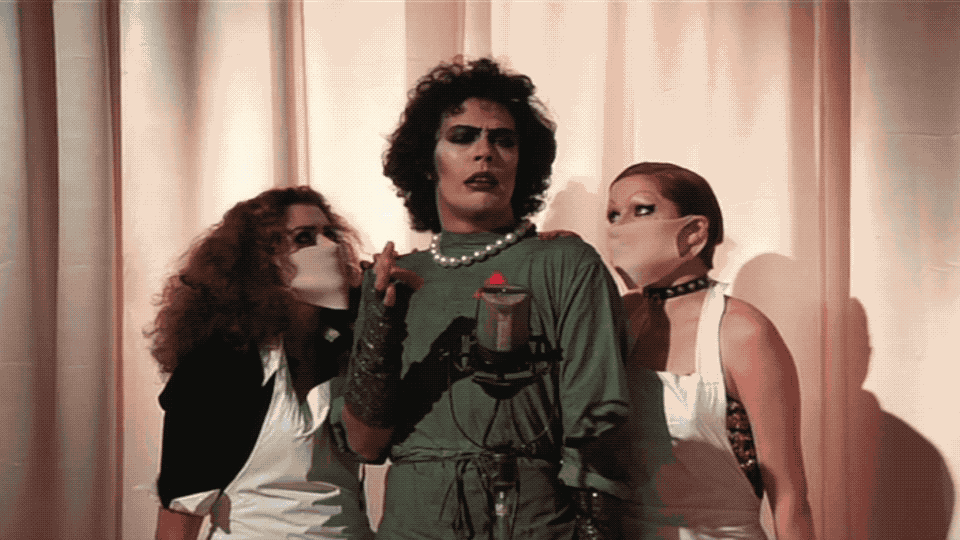

# 2. Libraries and Open Education

## **The Textbook Cost Crisis**

According to the College Board, the average undergraduate student should budget between $1,200 and $1,300 for textbooks and supplies each year \(College Board, 2014\). That’s as much as 40 percent of tuition at a two-year community college and 13 per cent at a four-year public institution. For many students and families already struggling to afford a college degree, that is simply too much – meaning more debt, working longer hours, or making choices that undermine academic success. In the United States, 31 percent of students have not registered for a course they’re interested in because of the textbook cost \(BCcampus, 2014\). That’s a loss for society as well as for that individual. Since 1978, college textbook costs have increased 812%. To put that in context, it means that textbook prices have increased at 3.2 times the rate of inflation.  

